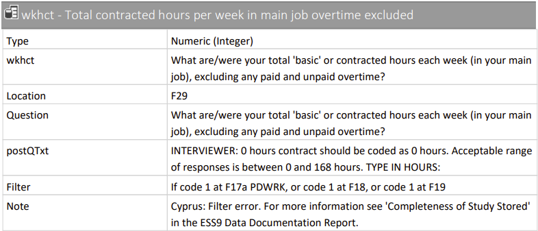
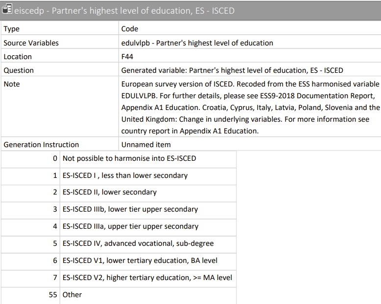
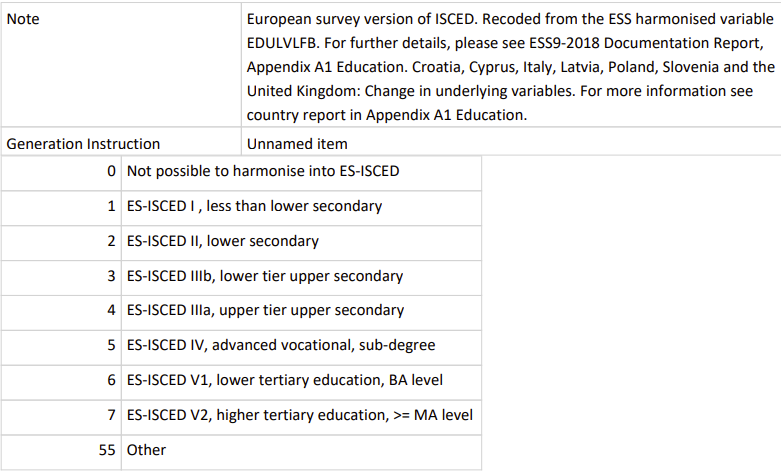

github: https://github.com/avven1re/SDA_GroupAssignment

```{r Loading Library & Data, message = F}
#devtools::install_github("amices/ggmice")
library(tidyverse)
library(mice)
library(ggmice)
library(psych)
library(visdat)

#Input Data
ess <- readRDS("Ess round 9.RDS")
```

Create a function to find the columns full of NAs
```{r Find NA Column Function}
#Find the column full of NAs
findNACol <- function(data){
  ind_vec <- c()
  j <- 1
  for (i in 1 : length(data[1, ])) {
    if(sum(is.na(data[, i])) == length(data[, i])){
      ind_vec[j] <- i
      j <- j + 1
    }
  }
  return(ind_vec)
}
```

Cutting the whole dataset by countries and get rid of NA columns
```{r}
cutd <- function(data = ess){
  cntrynames <- names(table(data$cntry))
  num_cntry <- length(cntrynames)
  cntrydata_list <- list()
  for (k in 1 : num_cntry) {
    cntry <- filter(data, cntry == cntrynames[k])
    index <- findNACol(cntry)
    processed <- cntry[, -index]
    
    cntrydata_list[[k]] <- processed
  }
  
  names(cntrydata_list) <- cntrynames
  return(cntrydata_list)
}

cntrydatalist <- cutd(ess)
```

We can see that each country has about 300~340 variables:
```{r}
summary(cntrydatalist)[, 1:2]
```

And now we get a list of each countries dataset and also remove the NA columns.

Here we can draw a barplot of the percentage every countries' missing values
```{r}
n_mvec <- matrix(NaN, nrow = 1, ncol = length(cntrydatalist))
for (i in 1 : length(cntrydatalist)) {
  n_mvec[i] <- sum(is.na(cntrydatalist[[i]])) / (dim(cntrydatalist[[i]])[1] * dim(cntrydatalist[[i]])[2]) * 100
}
colnames(n_mvec) <- names(cntrydatalist)
barplot(n_mvec, cex.names = 0.5, ylim = c(0, 0.8), main = "The missing value percentage in each country (%)")
```

Take NL for example, lets take a look of which variables include missing values:
```{r}
which(colSums(is.na(cntrydatalist$NL))>0)

m_NL_n <- names(which(colSums(is.na(cntrydatalist$NL))>0))
m_NL_n
```
From the ESS9 codebook, these variables are:
 
### eisced: Highest level of education
 
```{r, echo=FALSE, out.width = '75%'}
knitr::include_graphics("pics/eisced.png")
summary(cntrydatalist$NL["eisced"])
```

### wkhct: Total contracted hours per week in main job overtime excluded
 
```{r, echo=FALSE, out.width = '75%'}

summary(cntrydatalist$NL["wkhct"])
```

### wkhtot: Total hours normally worked per week in main job overtime included

```{r, echo=FALSE, out.width = '75%'}
knitr::include_graphics("pics/wkhtot.png")
summary(cntrydatalist$NL["wkhtot"])
```

### eiscedp: Partner's highest level of education
 
```{r, echo=FALSE, out.width = '75%'}

summary(cntrydatalist$NL["eiscedp"])
```

### wkhtotp: Hours normally worked a week in main job overtime included, partner
 
```{r, echo=FALSE, out.width = '75%'}
knitr::include_graphics("pics/wkhtotp.png")
summary(cntrydatalist$NL["wkhtotp"])
```

### eiscedf: Father's highest level of education
 
```{r, echo=FALSE, out.width = '75%'}
knitr::include_graphics("pics/eiscedf_1.png")

summary(cntrydatalist$NL["eiscedf"])
```

### eiscedm: Mother's highest level of education
 
```{r, echo=FALSE, out.width = '75%'}
knitr::include_graphics("pics/eiscedm.png")
summary(cntrydatalist$NL["eiscedm"])
```

 - inwtm: Interview length in minutes, main questionnaire (Not Interested)
 
So we have: 4 ordinal variables include missing values and 3 numerical variables include missing values.

```{r}
# "IE" "AT" "PT" "HU" "PL"
#summary(cntrydatalist$AT$hinctnta)

AT <- cntrydatalist$AT
IE <- cntrydatalist$IE
PT <- cntrydatalist$PT
HU <- cntrydatalist$HU
PL <- cntrydatalist$PL

barplot(table(IE$hinctnta), names.arg=c("1", "2", "3", "4", "5", "6", "7", "8", "9", "10", "Refusal", "Don't Know"),
        horiz = F, las = 2, col="#69b3a2", main = "The Distribution of hinctnta in AT")

barplot(table(AT$hinctnta), names.arg=c("1", "2", "3", "4", "5", "6", "7", "8", "9", "10", "Refusal", "Don't Know"),
        horiz = F, las = 2, col="#69b3a2", main = "The Distribution of hinctnta in IE")

barplot(table(PT$hinctnta), names.arg=c("1", "2", "3", "4", "5", "6", "7", "8", "9", "10", "Refusal", "Don't Know"),
        horiz = F, las = 2, col="#69b3a2", main = "The Distribution of hinctnta in PT")

barplot(table(HU$hinctnta), names.arg=c("1", "2", "3", "4", "5", "6", "7", "8", "9", "10", "Refusal", "Don't Know"),
        horiz = F, las = 2, col="#69b3a2", main = "The Distribution of hinctnta in HU")

barplot(table(PL$hinctnta), names.arg=c("1", "2", "3", "4", "5", "6", "7", "8", "9", "10", "Refusal", "Don't Know"),
        horiz = F, las = 2, col="#69b3a2", main = "The Distribution of hinctnta in PL")
```

```{r}
AT$hinctnta[AT$hinctnta == 88] <- NA
AT$hinctnta[AT$hinctnta == 77] <- NA

IE$hinctnta[IE$hinctnta == 88] <- NA
IE$hinctnta[IE$hinctnta == 77] <- NA

PT$hinctnta[PT$hinctnta == 88] <- NA
PT$hinctnta[PT$hinctnta == 77] <- NA

HU$hinctnta[HU$hinctnta == 88] <- NA
HU$hinctnta[HU$hinctnta == 77] <- NA

PL$hinctnta[PL$hinctnta == 88] <- NA
PL$hinctnta[PL$hinctnta == 77] <- NA
```

```{r}
na_mat <- matrix(c(sum(is.na(AT$hinctnta)), sum(is.na(IE$hinctnta)), 
                   sum(is.na(PT$hinctnta)), sum(is.na(HU$hinctnta)), sum(is.na(PL$hinctnta))), 1, 5)
colnames(na_mat) <- c("AT", "IE", "PT", "HU", "PL")
barplot(na_mat, main = "The number of missing values of hinctnta")

```

```{r}
per_na_mat <- matrix(c(sum(is.na(AT$hinctnta))/dim(AT)[1], sum(is.na(IE$hinctnta))/dim(IE)[1], 
                   sum(is.na(PT$hinctnta))/dim(PT)[1], sum(is.na(HU$hinctnta))/dim(HU)[1],
                   sum(is.na(PL$hinctnta))/dim(PL)[1]), 1, 5)
colnames(per_na_mat) <- c("AT", "IE", "PT", "HU", "PL")
barplot(per_na_mat, main = "The proportion of missing values of hinctnta in each country", ylim = c(0, 1.0))
```
Missing data patterns are not shown as they are uninformative.

To solven missingness in the income variable (hinctnta), we will use multiple imputation. However, since this variable is reported in deciles, imputation will not be straightforward. Ryder et al. (2011) recommend using the midpoint for each class as a surrogate to use for imputation. Furthermore, Donnelly and Pop-Eleches (2018) recommend to use the lower bound of the 10th category plus the width of category 9 as a surrogate for the highest decile. Since deciles differ across countries, this will be done seperately for each country.

```{r}
# Create decile objects and join for imputation.
# Changing the levels of hinctnta to be the median (the middle of the category) of the deciles

# Austria
AT_deciles <- cbind(1:10, c(7650, 18200, 23400, 28350, 34050, 40150, 47300, 56000, 69050, 94400)) %>%
  as.data.frame()
colnames(AT_deciles) <- c("hinctnta", "income")
AT_deciles$income <- as.numeric(AT_deciles$income) # make numeric

AT <- AT %>% left_join(AT_deciles, by = "hinctnta") # add income surrogate

# Ireland
IE_deciles <- cbind(1:10, c(135, 327.50, 447.5, 572.5, 710, 857.5, 1022.5, 1227.5, 1510, 2020)) %>% 
  as.data.frame()
colnames(IE_deciles) <- c("hinctnta", "income")
IE_deciles$income <- as.numeric(IE_deciles$income) # make numeric

IE <- IE %>% left_join(IE_deciles, by = "hinctnta") # add income surrogate

# Hungary
HU_deciles <- cbind(1:10, c(6500, 149500, 184500, 214500, 244500, 274500, 304500, 339500, 384500, 450000)) %>%
  as.data.frame()
colnames(HU_deciles) <- c("hinctnta", "income")
HU_deciles$income <- as.numeric(HU_deciles$income) # make numeric

HU <- HU %>% left_join(HU_deciles, by = "hinctnta") # add income surrogate

# Portugal
PT_deciles <- cbind(1:10, c(2818, 6709, 8847.5, 11265, 13885, 16556.5, 19728, 23948, 30566.5, 44143)) %>%
  as.data.frame()
colnames(PT_deciles) <- c("hinctnta", "income")
PT_deciles$income <- as.numeric(PT_deciles$income) # make numeric

PT <- PT %>% left_join(PT_deciles, by = "hinctnta") # add income surrogate

# Poland
PL_deciles <- cbind(1:10, c(850, 2000.5, 3650.5, 3300.5, 3950.5, 4650.5, 5450.5, 6450.5, 7900.5, 10600)) %>%
  as.data.frame()
colnames(PL_deciles) <- c("hinctnta", "income")
PL_deciles$income <- as.numeric(PL_deciles$income) # make numeric

PL <- PL %>% left_join(PL_deciles, by = "hinctnta") # add income surrogate
```

# Recode all relevant variables used for imputation model (missingness and variable levels)

```{r}
# Clean important variables chosen for the imputation model
# Define missing values and recode variables for the model

# Austria
AT$eisced[AT$eisced == 55] <- NA 
AT$eisced <- factor(AT$eisced, levels = c("1", "2", "3", "4", "5", "6", "7"), ordered = T)
AT$bthcld[AT$bthcld == 1] <- 0
AT$bthcld[AT$bthcld == 2] <- 1
AT$dscrgrp[AT$dscrgrp == 1] <- 0
AT$dscrgrp[AT$dscrgrp == 2] <- 1

AT$bthcld[AT$bthcld != 0 & AT$bthcld != 1] <- NA
AT$maritalb[!(AT$maritalb %in% c(1:6))] <- NA
AT$lrscale[!(AT$lrscale %in% c(0:10))] <- NA
AT$dscrgrp[AT$dscrgrp != 0 & AT$dscrgrp != 1] <- NA
AT$hhmmb[AT$hhmmb %in% c(77, 88)] <- NA
AT$agea[AT$agea == 999] <- NA

AT$bthcld <- as.factor(AT$bthcld)
AT$maritalb <- as.factor(AT$maritalb)
AT$dscrgrp <- as.factor(AT$dscrgrp)

# Hungary
HU$eisced[HU$eisced == 55] <- NA 
HU$eisced <- factor(HU$eisced, levels = c("1", "2", "3", "4", "5", "6", "7"), ordered = T)
HU$bthcld[HU$bthcld == 1] <- 0
HU$bthcld[HU$bthcld == 2] <- 1
HU$dscrgrp[HU$dscrgrp == 1] <- 0
HU$dscrgrp[HU$dscrgrp == 2] <- 1

HU$bthcld[HU$bthcld != 0 & HU$bthcld != 1] <- NA
HU$maritalb[!(HU$maritalb %in% c(1:6))] <- NA
HU$lrscale[!(HU$lrscale %in% c(0:10))] <- NA
HU$dscrgrp[HU$dscrgrp != 0 & HU$dscrgrp != 1] <- NA
HU$hhmmb[HU$hhmmb %in% c(77, 88)] <- NA
HU$agea[HU$agea == 999] <- NA

HU$bthcld <- as.factor(HU$bthcld)
HU$maritalb <- as.factor(HU$maritalb)
HU$dscrgrp <- as.factor(HU$dscrgrp)


# Ireland
IE$eisced[IE$eisced == 55] <- NA 
IE$eisced <- factor(IE$eisced, levels = c("1", "2", "3", "4", "5", "6", "7"), ordered = T)
IE$bthcld[IE$bthcld == 1] <- 0
IE$bthcld[IE$bthcld == 2] <- 1
IE$dscrgrp[IE$dscrgrp == 1] <- 0
IE$dscrgrp[IE$dscrgrp == 2] <- 1

IE$bthcld[IE$bthcld != 0 & IE$bthcld != 1] <- NA
IE$maritalb[!(IE$maritalb %in% c(1:6))] <- NA
IE$lrscale[!(IE$lrscale %in% c(0:10))] <- NA
IE$dscrgrp[IE$dscrgrp != 0 & IE$dscrgrp != 1] <- NA
IE$hhmmb[IE$hhmmb %in% c(77, 88)] <- NA
IE$agea[IE$agea == 999] <- NA

IE$bthcld <- as.factor(IE$bthcld)
IE$maritalb <- as.factor(IE$maritalb)
IE$dscrgrp <- as.factor(IE$dscrgrp)


# Portugal
PT$eisced[PT$eisced == 55] <- NA 
PT$eisced <- factor(PT$eisced, levels = c("1", "2", "3", "4", "5", "6", "7"), ordered = T)
PT$bthcld[PT$bthcld == 1] <- 0
PT$bthcld[PT$bthcld == 2] <- 1
PT$dscrgrp[PT$dscrgrp == 1] <- 0
PT$dscrgrp[PT$dscrgrp == 2] <- 1

PT$bthcld[PT$bthcld != 0 & PT$bthcld != 1] <- NA
PT$maritalb[!(PT$maritalb %in% c(1:6))] <- NA
PT$lrscale[!(PT$lrscale %in% c(0:10))] <- NA
PT$dscrgrp[PT$dscrgrp != 0 & PT$dscrgrp != 1] <- NA
PT$hhmmb[PT$hhmmb %in% c(77, 88)] <- NA
PT$agea[PT$agea == 999] <- NA

PT$bthcld <- as.factor(PT$bthcld)
PT$maritalb <- as.factor(PT$maritalb)
PT$dscrgrp <- as.factor(PT$dscrgrp)


# Poland
PL$eisced[PL$eisced == 55] <- NA 
PL$eisced <- factor(PL$eisced, levels = c("1", "2", "3", "4", "5", "6", "7"), ordered = T)
PL$bthcld[PL$bthcld == 1] <- 0
PL$bthcld[PL$bthcld == 2] <- 1
PL$dscrgrp[PL$dscrgrp == 1] <- 0
PL$dscrgrp[PL$dscrgrp == 2] <- 1

PL$bthcld[PL$bthcld != 0 & PL$bthcld != 1] <- NA
PL$maritalb[!(PL$maritalb %in% c(1:6))] <- NA
PL$lrscale[!(PL$lrscale %in% c(0:10))] <- NA
PL$dscrgrp[PL$dscrgrp != 0 & PL$dscrgrp != 1] <- NA
PL$hhmmb[PL$hhmmb %in% c(77, 88)] <- NA
PL$agea[PL$agea == 999] <- NA

PL$bthcld <- as.factor(PL$bthcld)
PL$maritalb <- as.factor(PL$maritalb)
PL$dscrgrp <- as.factor(PL$dscrgrp)

```

# Make subset of data with variables to be used. We will use 9 variables in addition to the analysis weight so we can weight the data during imputation
```{r}
# Create variable vector containing the names of relevant variables
variables <- c("pdwrk", "bthcld", "gndr", "maritalb","lrscale", "dscrgrp", "hhmmb", "agea", "wkhtot", "anweight", "income", "eisced")

# Select subsets of data with relevant variables
AT_sub <- AT %>% select(variables)

HU_sub <- HU %>% select(variables)

IE_sub <- IE %>% select(variables)

PT_sub <- PT %>% select(variables)

PL_sub <- PL %>% select(variables)
```

# Create interactions with weight variabels with covariates in imputation model

```{r}
# Interactions with anweight for Portugal
PT_sub$anweight_pdwrk <- PT_sub$anweight * PT_sub$pdwrk
PT_sub$anweight_bthcld <- PT_sub$anweight * as.numeric(PT_sub$bthcld)
PT_sub$anweight_lrscale <- PT_sub$anweight * PT_sub$lrscale
PT_sub$anweight_dscrgrp <- PT_sub$anweight * as.numeric(PT_sub$dscrgrp)
PT_sub$anweight_hhmmb <-PT_sub$anweight * PT_sub$hhmmb
PT_sub$anweight_agea <- PT_sub$anweight * PT_sub$agea
PT_sub$anweight_wkhtot <- PT_sub$anweight * PT_sub$wkhtot
PT_sub$anweight_income <- PT_sub$anweight *PT_sub$income
PT_sub$anweight_eisced <- PT_sub$anweight * as.numeric(PT_sub$eisced)

# Interactions with anweight for Austria
AT_sub$anweight_pdwrk <- AT_sub$anweight * AT_sub$pdwrk
AT_sub$anweight_bthcld <- AT_sub$anweight * as.numeric(AT_sub$bthcld)
AT_sub$anweight_lrscale <- AT_sub$anweight * AT_sub$lrscale
AT_sub$anweight_dscrgrp <- AT_sub$anweight * as.numeric(AT_sub$dscrgrp)
AT_sub$anweight_hhmmb <- AT_sub$anweight * AT_sub$hhmmb
AT_sub$anweight_agea <- AT_sub$anweight * AT_sub$agea
AT_sub$anweight_wkhtot <- AT_sub$anweight * AT_sub$wkhtot
AT_sub$anweight_income <- AT_sub$anweight * AT_sub$income
AT_sub$anweight_eisced <- AT_sub$anweight * as.numeric(AT_sub$eisced)

# Interactions with anweight for Hungary
HU_sub$anweight_pdwrk <- HU_sub$anweight * HU_sub$pdwrk
HU_sub$anweight_bthcld <- HU_sub$anweight * as.numeric(HU_sub$bthcld)
HU_sub$anweight_lrscale <- HU_sub$anweight * HU_sub$lrscale
HU_sub$anweight_dscrgrp <-HU_sub$anweight * as.numeric(HU_sub$dscrgrp)
HU_sub$anweight_hhmmb <- HU_sub$anweight * HU_sub$hhmmb
HU_sub$anweight_agea <- HU_sub$anweight * HU_sub$agea
HU_sub$anweight_wkhtot <- HU_sub$anweight * HU_sub$wkhtot
HU_sub$anweight_income <- HU_sub$anweight * HU_sub$income
HU_sub$anweight_eisced <- HU_sub$anweight * as.numeric(HU_sub$eisced)

# Interactions with anweight for Ireland
IE_sub$anweight_pdwrk <- IE_sub$anweight * IE_sub$pdwrk
IE_sub$anweight_bthcld <- IE_sub$anweight * as.numeric(IE_sub$bthcld)
IE_sub$anweight_lrscale <- IE_sub$anweight * IE_sub$lrscale
IE_sub$anweight_dscrgrp <- IE_sub$anweight * as.numeric(IE_sub$dscrgrp)
IE_sub$anweight_hhmmb <- IE_sub$anweight * IE_sub$hhmmb
IE_sub$anweight_agea <- IE_sub$anweight * IE_sub$agea
IE_sub$anweight_wkhtot <- IE_sub$anweight * IE_sub$wkhtot
IE_sub$anweight_income <- IE_sub$anweight * IE_sub$income
IE_sub$anweight_eisced <- IE_sub$anweight * as.numeric(IE_sub$eisced)

# Interactions with anweight for Poland
PL_sub$anweight_pdwrk <- PL_sub$anweight * PL_sub$pdwrk
PL_sub$anweight_bthcld <- PL_sub$anweight * as.numeric(PL_sub$bthcld)
PL_sub$anweight_lrscale <- PL_sub$anweight * PL_sub$lrscale
PL_sub$anweight_dscrgrp <- PL_sub$anweight * as.numeric(PL_sub$dscrgrp)
PL_sub$anweight_hhmmb <- PL_sub$anweight * PL_sub$hhmmb
PL_sub$anweight_agea <- PL_sub$anweight * PL_sub$agea
PL_sub$anweight_wkhtot <-  PL_sub$anweight * PL_sub$wkhtot
PL_sub$anweight_income <- PL_sub$anweight * PL_sub$income
PL_sub$anweight_eisced <- PL_sub$anweight * as.numeric(PL_sub$eisced)
```

# Make methods
```{r}
# Create methods for imputation models (this is the same for every country)
meth <- make.method(AT_sub)
```

# Make predictor matrix 
```{r}
# Predictor matrix for Portugal
PT_pred <- quickpred(PT_sub)
PT_pred[, 'income'] <- 1
PT_pred['income', 'income'] <- 0

# Predictor matrix for Austria
AT_pred <- quickpred(AT_sub)
AT_pred[, 'income'] <- 1
AT_pred['income', 'income'] <- 0

# Predictor matrix for Ireland
IE_pred <- quickpred(IE_sub)
IE_pred[, 'income'] <- 1
IE_pred['income', 'income'] <- 0

# Predictor matrix Hungary 
HU_pred <- quickpred(HU_sub)
HU_pred[, 'income'] <- 1
HU_pred['income', 'income'] <- 0

# Predictor matrix for Poland
PL_pred <- quickpred(PL_sub)
PL_pred[, 'income'] <- 1
PL_pred['income', 'income'] <- 0
```

# Imputation per country
```{r}
# Imputation for Portugal
vis_miss(PT_sub) # Imputing m sets according to amount of percentage missing in income
PT_imp <- mice(PT_sub,
               m = 20,
               maxit = 10, 
               method = meth,
               predictorMatrix = PT_pred,
               seed = 12345,
               print = FALSE)

# Imputation for Poland
vis_miss(PL_sub) # Imputing m sets according to amount of percentage missing in income
PL_imp <- mice(PL_sub,
               m = 39,
               maxit = 10, 
               method = meth,
               predictorMatrix = PL_pred,
               seed = 12345,
               print = FALSE)

# Imputation for Hungary
vis_miss(HU_sub) # Imputing m sets according to amount of percentage missing in income
HU_imp <- mice(HU_sub,
               m = 40,
               maxit = 10, 
               method = meth,
               predictorMatrix = HU_pred,
               seed = 12345,
               print = FALSE)

# Imputation for Ireland
vis_miss(IE_sub) # Imputing m sets according to amount of percentage missing in income
IE_imp <- mice(IE_sub,
               m = 28,
               maxit = 10, 
               method = meth,
               predictorMatrix = IE_pred,
               seed = 12345,
               print = FALSE)

# Imputation for Austria
vis_miss(AT_sub) # Imputing m sets according to amount of percentage missing in income
AT_imp <- mice(AT_sub,
               m = 18,
               maxit = 10, 
               method = meth,
               predictorMatrix = AT_pred,
               seed = 12345,
               print = FALSE)
```

# Checking convergence

```{r}
# Checking convergence for Portugal
plot(PT_imp)
densityplot(PT_imp)[4]
bwplot(PT_imp)[8]

# Outcome is midpoint of the median income class
PT_imp %>% 
  complete('long') %>% 
  with(tapply(income, .imp, median)) %>% 
  median()

# Checking convergence for Poland
plot(PL_imp)
densityplot(PL_imp)[4]
bwplot(PL_imp)[8]

# Outcome is midpoint of the median income class
PL_imp %>% 
  complete('long') %>% 
  with(tapply(income, .imp, median)) %>% 
  median()

# Checking convergence for Ireland
plot(IE_imp)
densityplot(IE_imp)[4]
bwplot(IE_imp)[8]

# Outcome is midpoint of the median income class
IE_imp %>% 
  complete('long') %>% 
  with(tapply(income, .imp, median)) %>% 
  median()

# Checking convergence for Hungary
plot(HU_imp)
densityplot(HU_imp)[4]
bwplot(HU_imp)[8]

# Outcome is midpoint of the median income class
HU_imp %>% 
  complete('long') %>% 
  with(tapply(income, .imp, median)) %>% 
  median()

# Checking convergence for Austria
plot(AT_imp)
densityplot(AT_imp)[4]
bwplot(AT_imp)[8]

# Outcome is midpoint of the median income class
AT_imp %>% 
  complete('long') %>% 
  with(tapply(income, .imp, median)) %>% 
  median()
```


Donnelly, M. J., & Pop-Eleches, G. (2018). Income measures in cross-national surveys: problems and solutions. Political Science Research and Methods, 6(2), 355-363.
