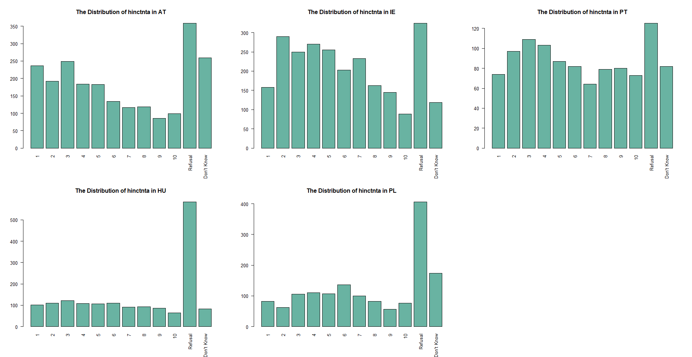

# INTRODUCTION

## The European Social Survey
According to the official website of the European Social Survey (ESS), the ESS is a survey conducted academically across Europe every two-year on a cross-national basis since 2001 through face-to-face interviews. Variables measured in this survey include the attitudes, beliefs and behaviour patterns of diverse populations. Its three main aims are, to monitor and interpret changing public attitudes and values within Europe and to investigate how they interact with Europe's changing institutions, to advance and consolidate improved methods of cross-national survey measurement in Europe and beyond, and to develop a series of European social indicators, including attitudinal indicators.

Until now, the ESS has had ten rounds, the first round conducted in 2002 and the tenth round in 2020. For analysis in this report, we will use data from the ninth round. In the ninth round, the survey covers 30 countries and employs the most rigorous methodologies funded by the Members, Observers and Guests of the ESS European Research Infrastructure Consortium (ESS ERIC) who represent national governments. 

The survey involves strict random probability sampling with a minimum target response rate of 70% and rigorous translation protocols. The hour-long face-to-face interview includes questions on a variety of core topics repeated from previous rounds of the survey and also two modules developed for Round 9 covering Justice and Fairness in Europe, and the Timing of Life (the latter is a partial repeat of a module from Round 3).

The scope of this survey is all persons aged 15 and over resident within private households, regardless of their nationality, citizenship, language or legal status, in the listed countries conducted from August 30, 2018, to January 27, 2020. The listed countries in the ninth round are Albania, Austria, Belgium, Bulgaria, Croatia, Cyprus, Czechia, Denmark, Estonia, Finland, France, Germany, Germany, Hungary, Iceland, Ireland, Italy, Latvia, Lithuania, Montenegro, Netherlands, Norway, Poland, Portugal, Romania, Serbia, Slovakia, Slovenia, Spain, Sweden, Sweden, Switzerland, United Kingdom.

By exploring the documentation file, we found that in the ninth round, there are four weights in this survey. 
Design Weights
The purpose of the design weights (DWEIGHT) is to correct for unequal probabilities for selection due to the sampling design used. In general design weights were computed for each country as follows.
w = 1/(PROB1*...*PROBk) is a nx1 vector of weights; k depends on the number of stages of the sampling design.
All weights were rescaled in a way that the sum of the final weights equals n, i.e. rescaled weights = n*w/sum(w).
It is not recommended to use this weight without non-response correction.
Post-stratification Weights
The purpose of the post-stratified design weights (PSPWGHT) is to reduce sampling error, non-coverage, and non-response bias, using auxiliary information specified by the sampling design. The post-stratification targets use information about age, gender, education and region. Raking (iterative proportional fitting) has been used in the production of the post-stratified weights. It also takes into account differences in population size across countries.
Analysis Weights
The analysis weight (ANWEIGHT) corrects for population size when combining two or more countries' data, and is calculated as ANWEIGHT=PSPWGHT*PWEIGHT. This is a weight in all analyses, it is constructed by first deriving the design weight, then applying a post-stratification adjustment, and then a population size adjustment.
Population Weights
The Population size weight (PWEIGHT) corrects for population size when combining
two or more country's data, and is calculated as PWEIGHT=[Population aged 15 years
and over]/[(Net sample in data file)*10 000]

## Objective
The purpose of this report is to impute missing values in the variable HINCTNTA. This variable is household income in deciles. The categories in variable HINCTNTA are national and based on deciles of the actual household income range in the given country. These deciles are derived from different sources. The median income is the reference point and the 10 deciles are calculated with the median itself at the top of the fifth decile (category F).  

# MISSING DATA CHALLENGE

## Select five countries
Here, we limit to five countries only to impute missing values. The five countries are selected randomly. The selected countries are Austria, Ireland, Portugal, Hungary, and Poland. These countries have different sources. In Austria and Portugal, it refers to annual household income with a lower limit is €15,300 €5,636 and an upper limit is €77,500 and €35,092, respectively. In Ireland, it refers to weekly household income with an upper limit of €1,680 and a lower limit of €270. Differently, in Hungary and Poland, household income refers to monthly income with a lower limit and an upper limit in Hungary Ft130,000 and Ft410,000 and zł1,700 and zł8,801 in Poland, respectively. 

The missing values themselves have three different types, which are refusal, don’t know, and no answer and coded differently. Here are the bar charts of five countries to show the frequency of missing values and each decile group.

```{r, echo=FALSE, out.width = '100%'}

```

## Missing values imputation
In order to fix missing values across countries, we decided to impute every country separately for some reasons. First, the variable HINCTNTA itself is differently distributed for every country, so simultaneous imputation would not make sense. This is also in line with other studies (Plumpton et al., 2016; Sintonen et al., 2016; Dorsch & Maarek, 2019; Weber & Denk, 2011; Landrum & Becker, 2001). Another thing is, not only is HINCTNTA differently distributed but the variable is divided into deciles, as can be seen in the plots, meaning that the range also differs for every country.

As we know, the income variable is a continuous variable. However, what we have here is in an ordinal scale because it is grouped as deciles. One study investigated imputation for ordinal data (Quintero and LeBoulluec, 2018) shows that the Random Selection method is the method with the best performance to treat the type of ordinal data and the most commonly used imputation methods such as mean and multiple imputations are not necessarily the most appropriate methods to treat ordinal data. 

However, as we know, the income variable should be on a continuous scale. Since the incomes are reported as deciles rather than the raw values, where each decile contains 10% of incomes in a country, this may yield some difficulties when imputing the variable. One option would be to treat the variables as nominal and then use polynomial regression to impute the income classes, but this would ignore the ordering of the variable and thus come with more difficulties. 

Ryder et al. (2011) recommend using the midpoint for each income class as a surrogate to be used for imputation so that the variable can be treated as a continuous variable. For instance, in an income class indicating €10000 - €16000, €13000 will be used as a surrogate. Furthermore, Donnelly and Pop-Eleches (2018) recommend using the lower bound of the 10th category plus the width of category 9 as a surrogate for the highest decile. Since deciles differ across countries, this will be done separately for each country.

If we then use predictive mean matching (PMM) as an imputation method, only observed values are used as possible imputed values, and thus these imputed values can again be transformed into the established income classes after imputation. PMM is a hot deck method that calculates the predicted value of the target variable based on the specified imputation model. The method establishes a small set of potential donors for each missing data from all complete cases that has the closest predicted value to the predicted value for the missing data then a random donor is taken from the candidate to replace the missing value assuming the missing data and observed data have the same distribution (van Buuren, 2018).

In the previous section, we also mentioned that there are weights included as variables in this survey. Based on previous research, weights are included to fix missing values. Quartagno et al. (2020) used an imputation model where the weights are included as additional variables. Kim et al. (2006) and Seaman et al. (2012) suggested a better imputation model should include not only the weights but also all interactions between weights and covariates. This can be done easily when missing data are confined to the outcome variable—but not when data are missing in all variables. Andridge and Little (2009) used the sampling weight as a stratifying variable alongside additional adjustment variables when forming adjustment cells (hot deck imputations). 

From the four kinds of weights, we only use analysis weight (ANWEIGHT) as a predictor variable because this is a weight in all analyses and can correct population size when combining more than one country. In addition to the analysis weight, we will use ten variables and interactions between those variables with the weight. The variables used are chosen based on previous studies and rational reasoning.

1. *PDWRK: partner doing paid work last 7 days*
    + Household income meaning income from for all workers in a household. We assume that if respondent’s partner is an active worker within the last 7 days then it will influence the total household income.
    
2. *BTHCLD: ever given birth to/ fathered a child*
    + According to Kolk (2021), fertility for both men and women groups has a positive relationship. It mentioned that men and women with two or more children have a higher income than people with one or no children.

3. *GNDR: gender of respondents *
    + Based on data from International Monetary Fund (2015), more men work than women in most countries and they get paid more for similar work. Therefore, the respondent’s gender obviously has a relationship with the household income.

4. *MARITALB: legal marital status*
    + Ideally, legal marital status has a relationship with household income. It is in line with a study from Balcazar (2019) that mentioned married individuals have the highest income level out of all groups (single, married, divorced, separated, never married). Moreover, unmarried couples in some countries are counted as separate households.

5. *LRSCALE: placement on left right scale*
    + We take the self-placement of Left-Right into consideration because household income is a significant predictor of respondents’ Left-Right self-placement, controlling all other variables (Esposito & Theuerkauf, 2021). It also mentioned a positive sign of income indicates that one's perception of family prosperity is related to one's placement on the right side of the ceteris paribus scale.

6. *DSCRGRP: member of a group discriminated against in this country*
    + Halanych et al. (2011) stated both income and education have a linear association with the presence of discrimination and intensity of discrimination. That is also in line with key findings from European Network Against Racism report: (1) ethnic minorities have fewer chances of getting through recruitment processes, (2) migrants and ethnic minorities tend to have jobs further down the hierarchy and lower wages, (3) migrant people and ethnic minorities have a much higher unemployment rate and are overrepresented in certain job positions or sectors, which may be a result of structural discriminatory inequalities, and (4) the financial crisis of 2008 continues to have particularly harsh consequences on ethnic minorities. 
    
7. *HHMMB: number of people living regularly as member of household*
    + Woofter Jr (1944) conducted a study to find the relationship between family size, family head age, and family income. He found that the most pronounced relationship between family income and family size appears in every age group. 
    
8. *AGEA: age of respondents*
    + Wędrowska and Muszyńska (2022) confirmed that age and level of education have an association with household income although they also stated that most elderly income comes from the pension.
    
9. *WKHTOT: total hours normally worked per week in main job overtime included*
    + As most of the European countries paid the workers based on hours of work, then we can assume that the total hours worked per week absolutely will determine the household income.
    
10. *EISCED: highest level of education*
    + As stated previously, Wędrowska and Muszyńska (2022) confirmed that the level of education has an association with household income and the level of education remains an important determinant of household income inequality.

# Methodology and Results

## Input data and packages 
```{r Loading Library & Data, message = F, echo = T}
#devtools::install_github("amices/ggmice")
library(tidyverse)
library(mice)
library(ggmice)
library(psych)
library(visdat)

#Input Data
ess <- readRDS("Ess round 9.RDS")
```

## Data processing
In order to obtain the data of the 5 chosen countries, we have to divide the original data.
```{r Find NA Column Function, echo = T}
#Find the column full of NAs
findNACol <- function(data){
  ind_vec <- c()
  j <- 1
  for (i in 1 : length(data[1, ])) {
    if(sum(is.na(data[, i])) == length(data[, i])){
      ind_vec[j] <- i
      j <- j + 1
    }
  }
  return(ind_vec)
}
```

```{r Cutting the whole dataset by countries and get rid of NA columns, echo = T}
#Cutting the whole dataset by countries and get rid of NA columns
cutd <- function(data = ess){
  cntrynames <- names(table(data$cntry))
  num_cntry <- length(cntrynames)
  cntrydata_list <- list()
  for (k in 1 : num_cntry) {
    cntry <- filter(data, cntry == cntrynames[k])
    index <- findNACol(cntry)
    processed <- cntry[, -index]
    
    cntrydata_list[[k]] <- processed
  }
  
  names(cntrydata_list) <- cntrynames
  return(cntrydata_list)
}

cntrydatalist <- cutd(ess)
```

Next, rename the data of each countries that we chose
```{r, echo = T}
AT <- cntrydatalist$AT
IE <- cntrydatalist$IE
PT <- cntrydatalist$PT
HU <- cntrydatalist$HU
PL <- cntrydatalist$PL
```

Replace the specific answers as NA. The missing values are coded differently for each reason: 99 is for the “no answer“ answer, 88 is for the “don’t know” answer, and 77 is for the “refusal” answer. No answer here is assumed mistakenly skipped by the respondents so it is missing completely at random (MCAR), but there is no case in these five countries. For refusal and don’t know, it is nonrandomly missing because it is missing nonrandomly at random MNAR). Therefore, the two kinds of missing values we have are both MNAR then we do not treat them differently.
```{r, echo = T}
AT$hinctnta[AT$hinctnta == 88] <- NA
AT$hinctnta[AT$hinctnta == 77] <- NA

IE$hinctnta[IE$hinctnta == 88] <- NA
IE$hinctnta[IE$hinctnta == 77] <- NA

PT$hinctnta[PT$hinctnta == 88] <- NA
PT$hinctnta[PT$hinctnta == 77] <- NA

HU$hinctnta[HU$hinctnta == 88] <- NA
HU$hinctnta[HU$hinctnta == 77] <- NA

PL$hinctnta[PL$hinctnta == 88] <- NA
PL$hinctnta[PL$hinctnta == 77] <- NA
```

And then we can take a brief look at the patterns of missing data
```{r, echo = F, out.width = '75%'}
na_mat <- matrix(c(sum(is.na(AT$hinctnta)), sum(is.na(IE$hinctnta)), 
                   sum(is.na(PT$hinctnta)), sum(is.na(HU$hinctnta)),
                   sum(is.na(PL$hinctnta))), 1, 5)
colnames(na_mat) <- c("AT", "IE", "PT", "HU", "PL")
barplot(na_mat, main = "The number of missing values of hinctnta")

```

```{r, echo = F, out.width = '75%'}
per_na_mat <- matrix(c(sum(is.na(AT$hinctnta))/dim(AT)[1],
                       sum(is.na(IE$hinctnta))/dim(IE)[1], 
                   sum(is.na(PT$hinctnta))/dim(PT)[1],
                   sum(is.na(HU$hinctnta))/dim(HU)[1],
                   sum(is.na(PL$hinctnta))/dim(PL)[1]), 1, 5)
colnames(per_na_mat) <- c("AT", "IE", "PT", "HU", "PL")
barplot(per_na_mat,
        main = "The proportion of missing values of hinctnta in each country",
        ylim = c(0, 1.0))
```

## Create Decile Objects
```{r, echo = T, warning=FALSE}
# Austria
AT_deciles <- cbind(1:10, c(7650, 18200, 23400, 28350, 34050
                            , 40150, 47300, 56000, 69050, 94400)) %>%
  as.data.frame()
colnames(AT_deciles) <- c("hinctnta", "income")
AT_deciles$income <- as.numeric(AT_deciles$income) # make numeric

AT <- AT %>% left_join(AT_deciles, by = "hinctnta") # add income surrogate

# Ireland
IE_deciles <- cbind(1:10, c(135, 327.50, 447.5, 572.5, 710
                            , 857.5, 1022.5, 1227.5, 1510, 2020)) %>% 
  as.data.frame()
colnames(IE_deciles) <- c("hinctnta", "income")
IE_deciles$income <- as.numeric(IE_deciles$income) # make numeric

IE <- IE %>% left_join(IE_deciles, by = "hinctnta") # add income surrogate

# Hungary
HU_deciles <- cbind(1:10, c(6500, 149500, 184500, 214500, 244500
                            , 274500, 304500, 339500, 384500, 450000)) %>%
  as.data.frame()
colnames(HU_deciles) <- c("hinctnta", "income")
HU_deciles$income <- as.numeric(HU_deciles$income) # make numeric

HU <- HU %>% left_join(HU_deciles, by = "hinctnta") # add income surrogate

# Portugal
PT_deciles <- cbind(1:10, c(2818, 6709, 8847.5, 11265, 13885, 16556.5
                            , 19728, 23948, 30566.5, 44143)) %>%
  as.data.frame()
colnames(PT_deciles) <- c("hinctnta", "income")
PT_deciles$income <- as.numeric(PT_deciles$income) # make numeric

PT <- PT %>% left_join(PT_deciles, by = "hinctnta") # add income surrogate

# Poland
PL_deciles <- cbind(1:10, c(850, 2000.5, 3650.5, 3300.5, 3950.5, 4650.5
                            , 5450.5, 6450.5, 7900.5, 10600)) %>%
  as.data.frame()
colnames(PL_deciles) <- c("hinctnta", "income")
PL_deciles$income <- as.numeric(PL_deciles$income) # make numeric

PL <- PL %>% left_join(PL_deciles, by = "hinctnta") # add income surrogate
```

We add a midpoint for each decile group for five countries according to data from the documentation, therefore its currency and referred household income (annual, monthly, or, weekly) has been adjusted. After that, recode all relevant variables used for the imputation model (missingness and variable levels). We only take variables for predictors as mentioned in the previous section.

## Define Missing Values and Recode 
```{r, warning=FALSE}
# Clean important variables chosen for the imputation model
# Define missing values and recode variables for the model

# Austria
AT$eisced[AT$eisced == 55] <- NA 
AT$eisced <- factor(AT$eisced, levels = c("1", "2", "3", "4", "5", "6", "7"),
                    ordered = T)
AT$bthcld[AT$bthcld == 1] <- 0
AT$bthcld[AT$bthcld == 2] <- 1
AT$dscrgrp[AT$dscrgrp == 1] <- 0
AT$dscrgrp[AT$dscrgrp == 2] <- 1

AT$bthcld[AT$bthcld != 0 & AT$bthcld != 1] <- NA
AT$maritalb[!(AT$maritalb %in% c(1:6))] <- NA
AT$lrscale[!(AT$lrscale %in% c(0:10))] <- NA
AT$dscrgrp[AT$dscrgrp != 0 & AT$dscrgrp != 1] <- NA
AT$hhmmb[AT$hhmmb %in% c(77, 88)] <- NA
AT$agea[AT$agea == 999] <- NA

AT$bthcld <- as.factor(AT$bthcld)
AT$maritalb <- as.factor(AT$maritalb)
AT$dscrgrp <- as.factor(AT$dscrgrp)

# Hungary
HU$eisced[HU$eisced == 55] <- NA 
HU$eisced <- factor(HU$eisced, levels = c("1", "2", "3", "4", "5", "6", "7"),
                    ordered = T)
HU$bthcld[HU$bthcld == 1] <- 0
HU$bthcld[HU$bthcld == 2] <- 1
HU$dscrgrp[HU$dscrgrp == 1] <- 0
HU$dscrgrp[HU$dscrgrp == 2] <- 1

HU$bthcld[HU$bthcld != 0 & HU$bthcld != 1] <- NA
HU$maritalb[!(HU$maritalb %in% c(1:6))] <- NA
HU$lrscale[!(HU$lrscale %in% c(0:10))] <- NA
HU$dscrgrp[HU$dscrgrp != 0 & HU$dscrgrp != 1] <- NA
HU$hhmmb[HU$hhmmb %in% c(77, 88)] <- NA
HU$agea[HU$agea == 999] <- NA

HU$bthcld <- as.factor(HU$bthcld)
HU$maritalb <- as.factor(HU$maritalb)
HU$dscrgrp <- as.factor(HU$dscrgrp)

# Ireland
IE$eisced[IE$eisced == 55] <- NA 
IE$eisced <- factor(IE$eisced, levels = c("1", "2", "3", "4", "5", "6", "7"),
                    ordered = T)
IE$bthcld[IE$bthcld == 1] <- 0
IE$bthcld[IE$bthcld == 2] <- 1
IE$dscrgrp[IE$dscrgrp == 1] <- 0
IE$dscrgrp[IE$dscrgrp == 2] <- 1

IE$bthcld[IE$bthcld != 0 & IE$bthcld != 1] <- NA
IE$maritalb[!(IE$maritalb %in% c(1:6))] <- NA
IE$lrscale[!(IE$lrscale %in% c(0:10))] <- NA
IE$dscrgrp[IE$dscrgrp != 0 & IE$dscrgrp != 1] <- NA
IE$hhmmb[IE$hhmmb %in% c(77, 88)] <- NA
IE$agea[IE$agea == 999] <- NA

IE$bthcld <- as.factor(IE$bthcld)
IE$maritalb <- as.factor(IE$maritalb)
IE$dscrgrp <- as.factor(IE$dscrgrp)

# Portugal
PT$eisced[PT$eisced == 55] <- NA 
PT$eisced <- factor(PT$eisced, levels = c("1", "2", "3", "4", "5", "6", "7"),
                    ordered = T)
PT$bthcld[PT$bthcld == 1] <- 0
PT$bthcld[PT$bthcld == 2] <- 1
PT$dscrgrp[PT$dscrgrp == 1] <- 0
PT$dscrgrp[PT$dscrgrp == 2] <- 1

PT$bthcld[PT$bthcld != 0 & PT$bthcld != 1] <- NA
PT$maritalb[!(PT$maritalb %in% c(1:6))] <- NA
PT$lrscale[!(PT$lrscale %in% c(0:10))] <- NA
PT$dscrgrp[PT$dscrgrp != 0 & PT$dscrgrp != 1] <- NA
PT$hhmmb[PT$hhmmb %in% c(77, 88)] <- NA
PT$agea[PT$agea == 999] <- NA

PT$bthcld <- as.factor(PT$bthcld)
PT$maritalb <- as.factor(PT$maritalb)
PT$dscrgrp <- as.factor(PT$dscrgrp)


# Poland
PL$eisced[PL$eisced == 55] <- NA 
PL$eisced <- factor(PL$eisced, levels = c("1", "2", "3", "4", "5", "6", "7"),
                    ordered = T)
PL$bthcld[PL$bthcld == 1] <- 0
PL$bthcld[PL$bthcld == 2] <- 1
PL$dscrgrp[PL$dscrgrp == 1] <- 0
PL$dscrgrp[PL$dscrgrp == 2] <- 1

PL$bthcld[PL$bthcld != 0 & PL$bthcld != 1] <- NA
PL$maritalb[!(PL$maritalb %in% c(1:6))] <- NA
PL$lrscale[!(PL$lrscale %in% c(0:10))] <- NA
PL$dscrgrp[PL$dscrgrp != 0 & PL$dscrgrp != 1] <- NA
PL$hhmmb[PL$hhmmb %in% c(77, 88)] <- NA
PL$agea[PL$agea == 999] <- NA

PL$bthcld <- as.factor(PL$bthcld)
PL$maritalb <- as.factor(PL$maritalb)
PL$dscrgrp <- as.factor(PL$dscrgrp)

```

## Make Data Subset 
```{r, warning=FALSE}
# Create variable vector containing the names of relevant variables
variables <- c("pdwrk", "bthcld", "gndr", "maritalb","lrscale", "dscrgrp",
               "hhmmb", "agea", "wkhtot", "anweight", "income", "eisced")

# Select subsets of data with relevant variables
AT_sub <- AT %>% select(variables)

HU_sub <- HU %>% select(variables)

IE_sub <- IE %>% select(variables)

PT_sub <- PT %>% select(variables)

PL_sub <- PL %>% select(variables)
```
```{r}
# Interactions with anweight for Portugal
PT_sub$anweight_pdwrk <- PT_sub$anweight * PT_sub$pdwrk
PT_sub$anweight_bthcld <- PT_sub$anweight * as.numeric(PT_sub$bthcld)
PT_sub$anweight_lrscale <- PT_sub$anweight * PT_sub$lrscale
PT_sub$anweight_dscrgrp <- PT_sub$anweight * as.numeric(PT_sub$dscrgrp)
PT_sub$anweight_hhmmb <-PT_sub$anweight * PT_sub$hhmmb
PT_sub$anweight_agea <- PT_sub$anweight * PT_sub$agea
PT_sub$anweight_wkhtot <- PT_sub$anweight * PT_sub$wkhtot
PT_sub$anweight_income <- PT_sub$anweight *PT_sub$income
PT_sub$anweight_eisced <- PT_sub$anweight * as.numeric(PT_sub$eisced)
PT_sub$anweight_gndr <- PT_sub$anweight * as.numeric(PT_sub$gndr)

# Interactions with anweight for Austria
AT_sub$anweight_pdwrk <- AT_sub$anweight * AT_sub$pdwrk
AT_sub$anweight_bthcld <- AT_sub$anweight * as.numeric(AT_sub$bthcld)
AT_sub$anweight_lrscale <- AT_sub$anweight * AT_sub$lrscale
AT_sub$anweight_dscrgrp <- AT_sub$anweight * as.numeric(AT_sub$dscrgrp)
AT_sub$anweight_hhmmb <- AT_sub$anweight * AT_sub$hhmmb
AT_sub$anweight_agea <- AT_sub$anweight * AT_sub$agea
AT_sub$anweight_wkhtot <- AT_sub$anweight * AT_sub$wkhtot
AT_sub$anweight_income <- AT_sub$anweight * AT_sub$income
AT_sub$anweight_eisced <- AT_sub$anweight * as.numeric(AT_sub$eisced)
AT_sub$anweight_gndr <- AT_sub$anweight * as.numeric(AT_sub$gndr)

# Interactions with anweight for Hungary
HU_sub$anweight_pdwrk <- HU_sub$anweight * HU_sub$pdwrk
HU_sub$anweight_bthcld <- HU_sub$anweight * as.numeric(HU_sub$bthcld)
HU_sub$anweight_lrscale <- HU_sub$anweight * HU_sub$lrscale
HU_sub$anweight_dscrgrp <-HU_sub$anweight * as.numeric(HU_sub$dscrgrp)
HU_sub$anweight_hhmmb <- HU_sub$anweight * HU_sub$hhmmb
HU_sub$anweight_agea <- HU_sub$anweight * HU_sub$agea
HU_sub$anweight_wkhtot <- HU_sub$anweight * HU_sub$wkhtot
HU_sub$anweight_income <- HU_sub$anweight * HU_sub$income
HU_sub$anweight_eisced <- HU_sub$anweight * as.numeric(HU_sub$eisced)
HU_sub$anweight_gndr <- HU_sub$anweight * as.numeric(HU_sub$gndr)

# Interactions with anweight for Ireland
IE_sub$anweight_pdwrk <- IE_sub$anweight * IE_sub$pdwrk
IE_sub$anweight_bthcld <- IE_sub$anweight * as.numeric(IE_sub$bthcld)
IE_sub$anweight_lrscale <- IE_sub$anweight * IE_sub$lrscale
IE_sub$anweight_dscrgrp <- IE_sub$anweight * as.numeric(IE_sub$dscrgrp)
IE_sub$anweight_hhmmb <- IE_sub$anweight * IE_sub$hhmmb
IE_sub$anweight_agea <- IE_sub$anweight * IE_sub$agea
IE_sub$anweight_wkhtot <- IE_sub$anweight * IE_sub$wkhtot
IE_sub$anweight_income <- IE_sub$anweight * IE_sub$income
IE_sub$anweight_eisced <- IE_sub$anweight * as.numeric(IE_sub$eisced)
IE_sub$anweight_gndr <- IE_sub$anweight * as.numeric(IE_sub$gndr)

# Interactions with anweight for Poland
PL_sub$anweight_pdwrk <- PL_sub$anweight * PL_sub$pdwrk
PL_sub$anweight_bthcld <- PL_sub$anweight * as.numeric(PL_sub$bthcld)
PL_sub$anweight_lrscale <- PL_sub$anweight * PL_sub$lrscale
PL_sub$anweight_dscrgrp <- PL_sub$anweight * as.numeric(PL_sub$dscrgrp)
PL_sub$anweight_hhmmb <- PL_sub$anweight * PL_sub$hhmmb
PL_sub$anweight_agea <- PL_sub$anweight * PL_sub$agea
PL_sub$anweight_wkhtot <-  PL_sub$anweight * PL_sub$wkhtot
PL_sub$anweight_income <- PL_sub$anweight * PL_sub$income
PL_sub$anweight_eisced <- PL_sub$anweight * as.numeric(PL_sub$eisced)
PL_sub$anweight_gndr <- PL_sub$anweight * as.numeric(PL_sub$gndr)

```

## Define Methods and Predictor Matrix
Methods for imputation models are the same for all countries. We would like to use the PMM method. PMM method has an assumption that missing values need to be MAR, but our missing data is MNAR, not MAR.  However, according to Erler (2020), to reduce bias due to MNAR missingness we can add as much information as possible to make the MAR assumption more plausible. As we have ten predictors, we assume that the MAR assumption is plausible then PMM can be used to predictor missing values of household income.
```{r, warning=FALSE}
# Create methods for imputation models (this is the same for every country)
meth <- make.method(AT_sub)
```

Define the predictor matrix for each country.
```{r, warning=FALSE}
# Predictor matrix for Portugal
PT_pred <- quickpred(PT_sub)
PT_pred[, 'income'] <- 1
PT_pred['income', 'income'] <- 0

# Predictor matrix for Austria
AT_pred <- quickpred(AT_sub)
AT_pred[, 'income'] <- 1
AT_pred['income', 'income'] <- 0

# Predictor matrix for Ireland
IE_pred <- quickpred(IE_sub)
IE_pred[, 'income'] <- 1
IE_pred['income', 'income'] <- 0

# Predictor matrix Hungary 
HU_pred <- quickpred(HU_sub)
HU_pred[, 'income'] <- 1
HU_pred['income', 'income'] <- 0

# Predictor matrix for Poland
PL_pred <- quickpred(PL_sub)
PL_pred[, 'income'] <- 1
PL_pred['income', 'income'] <- 0
```

## Imputation
As mentioned earlier, we will fix missing values by imputing per country since each country has a different currency and calculate in a different way (weekly, monthly, or annual).
```{r, results = 'hide', fig.show='hide', warning=FALSE}
# Imputation for Portugal
vis_miss(PT_sub) # Imputing m sets according to amount of percentage missing in income
PT_imp <- mice(PT_sub,
               m = 20,
               maxit = 10, 
               method = meth,
               predictorMatrix = PT_pred,
               seed = 12345,
               print = FALSE)

# Imputation for Poland
vis_miss(PL_sub) # Imputing m sets according to amount of percentage missing in income
PL_imp <- mice(PL_sub,
               m = 39,
               maxit = 10, 
               method = meth,
               predictorMatrix = PL_pred,
               seed = 12345,
               print = FALSE)

# Imputation for Hungary
vis_miss(HU_sub) # Imputing m sets according to amount of percentage missing in income
HU_imp <- mice(HU_sub,
               m = 40,
               maxit = 10, 
               method = meth,
               predictorMatrix = HU_pred,
               seed = 12345,
               print = FALSE)

# Imputation for Ireland
vis_miss(IE_sub) # Imputing m sets according to amount of percentage missing in income
IE_imp <- mice(IE_sub,
               m = 28,
               maxit = 10, 
               method = meth,
               predictorMatrix = IE_pred,
               seed = 12345,
               print = FALSE)

# Imputation for Austria
vis_miss(AT_sub) # Imputing m sets according to amount of percentage missing in income
AT_imp <- mice(AT_sub,
               m = 18,
               maxit = 10, 
               method = meth,
               predictorMatrix = AT_pred,
               seed = 12345,
               print = FALSE)
```

The number of multiple imputations defined by what for each country is based on the percentage of missing for income in the dataset.

## Checking convergence
```{r, results='hide', fig.show='hide'}
# Checking convergence for Portugal
plot(PT_imp)
```
```{r, message=FALSE}
densityplot(PT_imp)[4]
bwplot(PT_imp)[8]

# Outcome is midpoint of the median income class
PT_imp %>% 
  complete('long') %>% 
  with(tapply(income, .imp, median)) %>% 
  median()
```
```{r, results='hide', fig.show='hide'}
# Checking convergence for Poland
plot(PL_imp)
```
```{r, message=FALSE}
densityplot(PL_imp)[4]
bwplot(PL_imp)[8]

# Outcome is midpoint of the median income class
PL_imp %>% 
  complete('long') %>% 
  with(tapply(income, .imp, median)) %>% 
  median()
```
```{r, results='hide', fig.show='hide'}
# Checking convergence for Ireland
plot(IE_imp)
```
```{r, message=FALSE}
densityplot(IE_imp)[4]
bwplot(IE_imp)[8]

# Outcome is midpoint of the median income class
IE_imp %>% 
  complete('long') %>% 
  with(tapply(income, .imp, median)) %>% 
  median()
```
```{r, results='hide', fig.show='hide'}
# Checking convergence for Hungary
plot(HU_imp)
```
```{r, message=FALSE}
densityplot(HU_imp)[4]
bwplot(HU_imp)[8]

# Outcome is midpoint of the median income class
HU_imp %>% 
  complete('long') %>% 
  with(tapply(income, .imp, median)) %>% 
  median()
```
```{r, results='hide', fig.show='hide'}
# Checking convergence for Austria
plot(AT_imp)
```
```{r, message=FALSE}
densityplot(AT_imp)[4]
bwplot(AT_imp)[8]

# Outcome is midpoint of the median income class
AT_imp %>% 
  complete('long') %>% 
  with(tapply(income, .imp, median)) %>% 
  median()
```

# Calculate Error 
In order to calculate the standard error, we use the pool function. After imputing missing data by the mice function, we use with() function to fit the model of interest and then pool the estimates from each model into a single set of estimates and standard errors. For the regression linear function, we use weight as an independent variable and income as the outcome variable.

```{r, warning=FALSE}
summary(pool(with(PL_imp, lm(income~anweight))))

summary(pool(with(PT_imp, lm(income~anweight))))

summary(pool(with(AT_imp, lm(income~anweight))))

summary(pool(with(HU_imp, lm(income~anweight))))

summary(pool(with(IE_imp, lm(income~anweight))))

```

From the above results, we can see that the standard error for estimation in Ireland is the smallest and the highest standard error is the estimation in Hungary. The other three countries have almost similar standard errors. It might happen due to the three countries use the same currency.

# Conclusion
The main purpose of this report was to impute missing values for household income from the European Social Survey. We were only interested to do an imputation for five countries. The selection process for the countries was not defined. Household income from selected countries, which are Austria, Hungary, Ireland, Poland, and Portugal, was imputed. We had a household income on an ordinal scale, grouped by deciles.
There are some methods that can be used to impute missing values for ordinal data. However, we fixed it by using midpoints from each group since by nature the scale of income is continuous. We used the MICE package in R and use the PMM method for imputation. Missing objects in the five countries come from refusal and don’t know the answer, meaning it may be MNAR rather than MAR. In order to overcome bias then we used PMM, and we used theoretically plausible predictors. Then, 10 predictors were used in addition to the analysis weights and the interaction of the variables with the weights. In this way, the weighting was done while imputing the data. The chosen variables were defined by previous studies.
With the maximum iteration of 10, we can see from the plot in the previous section that the imputation process for all countries is convergence. After imputation, the median value of household income for complete data in Portugal, Poland, Ireland, Hungary, and Austria are 13,885; 3,950; 572.5; 214,500; and 34,050 respectively. Referring to the documentation from the ESS, the median income is at the top of the fifth decile (category F). The top of the fifth decile in Portugal, Poland, Ireland, Hungary, and Austria respectively are 15,152; 4,300; 562; 259,000; and 37,100. The error rates from the imputation (difference values from imputation and true value divided by the true value) are around 8% for Poland, Portugal, and Austria, while Hungary has a 17% error rate and Ireland has 1.7%. The error rates are in line with the result of the standard error obtained by using the pool function.


# Reference
Andridge, R. R., &Little, R.J. (2009). The Use of Sample Weights in Hot Deck Imputation. Journal of Official Statistics, 25(1), 21-36. https://doi.org/https://www.ncbi.nlm.nih.gov/pmc/articles/PMC3117228/ 

Balcazar, J. (2019). Marriage and Income: Differences in marital status on outcomes of individual wealth. Preprints.

Donnelly, M. J., & Pop-Eleches, G. (2018). Income measures in cross-national surveys: problems and solutions. Political Science Research and Methods, 6(2), 355-363.

Dorch, M. T., & Maaraek, P. (2019). Democratization and the Conditional Dynamics of Income Distribution. American Political Science Review, 113(2), 385–404. https://doi.org/10.1017/s0003055418000825.

Erler, N. (2020). Missing Values in Clinical Research: Multiple Imputation, Strategies for Using MICE. https://nerler.github.io/EP16_Multiple_Imputation/slide/14_strategies.pdf 

European Network Against Racism. (2018). Racism & Discrimination in Employment in Europe 2013-2017. https://ec.europa.eu/migrant-integration/sites/default/files/2018-07/ENAR_Shadowreport_2013_2017.pdf

Esposito, L., & Theuerkauf, U. G. (2021). Economic Well-being and Self Placements on a Left-Right Scale: Evidence from Undergraduate Students in Seven Countries. Journal of Political Ideologies. https://doi.org/10.1080/13569317.2021.2003974 

Halanych, J. H., Safford, M. M., Shikany, J. M., Cuffee, Y., Person, S. D., Scarinci, I. C., Kiefe, C. I., & Allison, J. J. (2011). The Association Between Income, Education, and Experiences of Discrimination in Older African American and European American Patients. Ethnicity & disease, 21(2), 223. https://doi.org/https://www.ncbi.nlm.nih.gov/pmc/articles/PMC6095474/ 

International Monetary Fund. (2015). Infographic: Gender and Income Inequality. https://www.imf.org/external/pubs/ft/sdn/2015/sdn1520_info.pdf

Kim J. K., Michael Brick J., Fuller W. A., & Kalton G. (2006), On the Bias of the Multiple-Imputation Variance Estimator in Survey Sampling. Journal of the Royal Statistical Society: Series B (Statistical Methodology), 68(3), 509–521. https://doi.org/10.1111/j.1467-9868.2006.00546.x

Kolk, M. (2022). The Relationship Between Life-course Accumulated Income and Childbearing of Swedish Men and Women Born 1940–70. Population Studies. https://doi.org/10.1080/00324728.2022.2134578 

Landrum, M. B., & Becker, M. P. (2001). A Multiple Imputation Strategy for Incomplete Longitudinal Data. Statistics in Medicine, 20(17–18), 2741–2760. https://doi.org/10.1002/sim.740.

Plumpton, C. O., Morris, T., Hughes, D. A., & White, I. R. (2016). Multiple Imputation of Multiple Multi-item Scales When a Full Imputation Model is Infeasible. BMC Research Notes, 9(1). https://doi.org/10.1186/s13104-016-1853.

Quartagno, M., Carpenter, J. R., & Goldstein, H. (2020). Multiple Imputation with Survey Weights: A Multilevel Approach. Journal of Survey Statistics and Methodology, 8(5), 965-989. https://doi.org/10.1093/jssam/smz036

Quintero, M., & Leboulluec, A. (2018). Missing Data Imputation for Ordinal Data. International Journal of Computer Applications, 181(5). 10-16. https://doi.org/10.5120/ijca2018917522. 

Ryder, A. B., Wilkinson, A. V., McHugh, M. K., Saunders, K., Kachroo, S., D'Amelio, A., Jr, Bondy, M., & Etzel, C. J. (2011). The Advantage of Imputation of Missing Income Data to Evaluate the Association Between Income and Self-reported Health Status (SRH) in a Mexican American Cohort Study. Journal of Immigrant and Minority Health, 13(6), 1099–1109. https://doi.org/10.1007/s10903-010-9415-8.

Seaman S. R. , White I. R., Copas A. J., & Li L. (2012). Combining Multiple Imputation and Inverse-Probability Weighting. Biometrics, 68(1), 129–137. https://doi.org/10.1111/j.1541-0420.2011.01666.x

Sintonen, S., Tarkiainen, A., Cadogan, J. W., Kuivalainen, O., Lee, N., & Sundqvist, S. (2016). Cross-country Cross-survey Design in International Marketing Research. International Marketing Review, 33(3), 454–482. https://doi.org/10.1108/imr-11-2014-0348.

Van Buuren, S. (2018). Flexible Imputation of Missing Data. Chapman&Hall/ CRC Interdisciplinary Statistics. Taylor and Francis. https://stefvanbuuren.name/fimd/sec-pmm.html 

Weber, M., & Denk, M. (2011). Avoid Filling Swiss Cheese with Whipped Cream: Imputation Techniques and Evaluation Procedures for Cross-Country Time Series. IMF Working Papers, 11(151), 1. https://doi.org/10.5089/9781455270507.001.

Wędrowska, E., & Muszyńska, J. (2022). Role of Age and Education as the Determinant of Income Inequality in Poland: Decomposition of the Mean Logarithmic Deviation. Entropy, 24(6). https://doi.org/10.3390/e24060773.

Woofter, Jr., T. J. (1944). Size of Family in Relation to Family Income and Age of Family Head. American Sociological Review, 9(6), 678–684. https://doi.org/10.2307/2085132.
