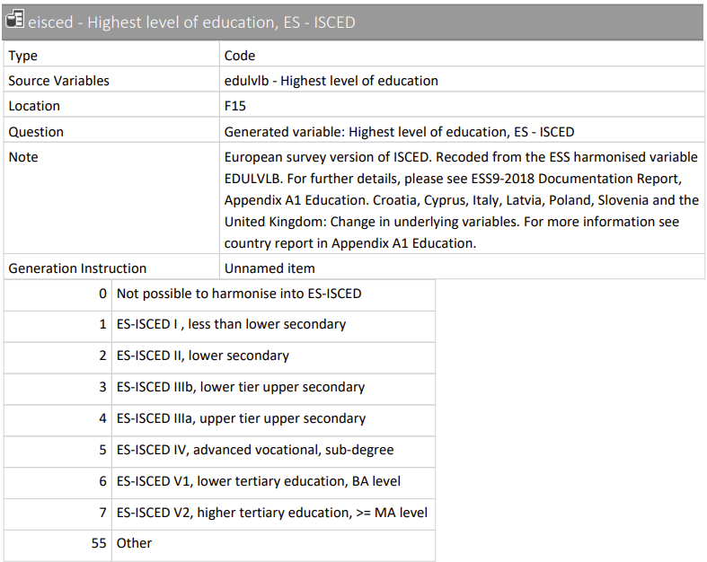
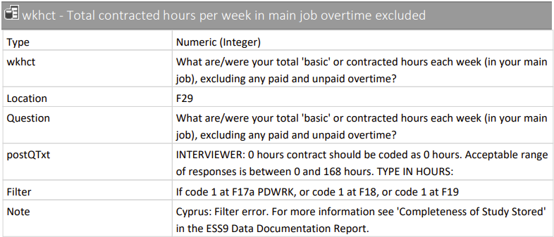
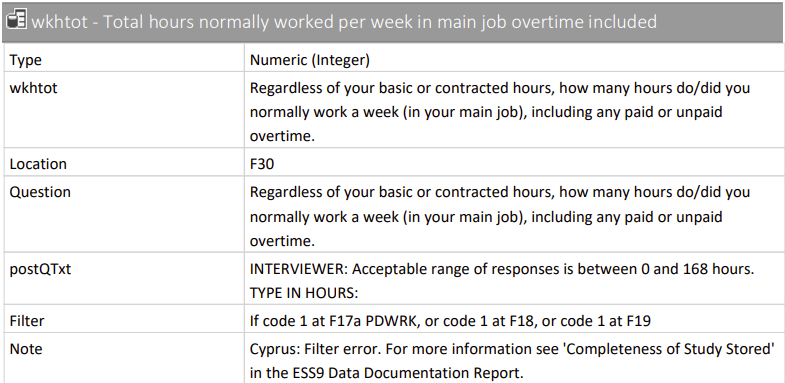
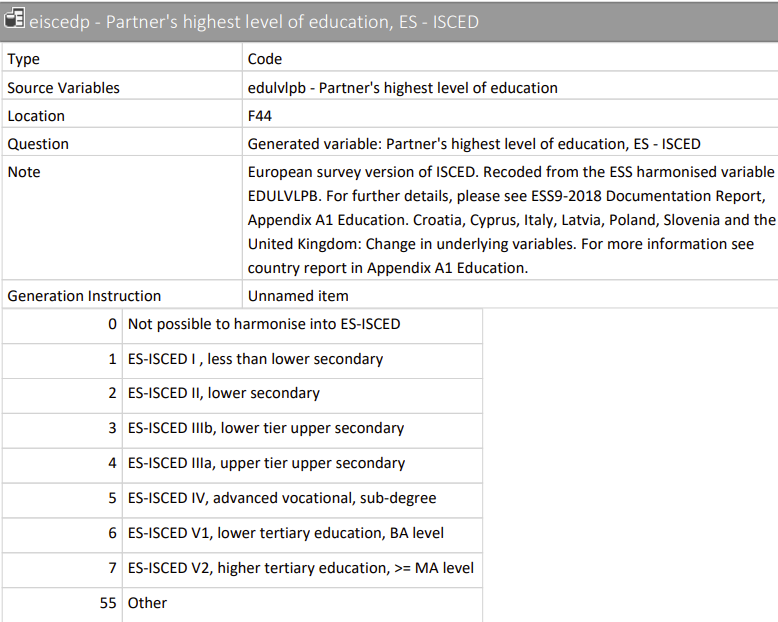
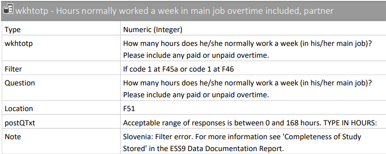
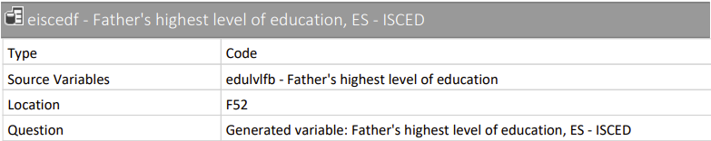
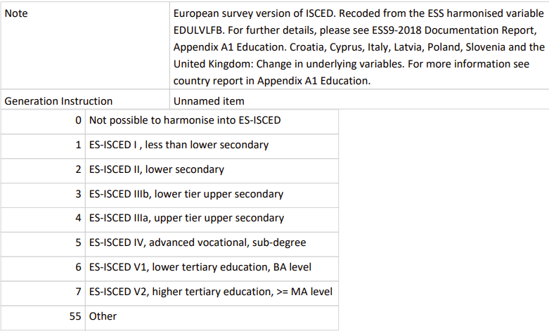
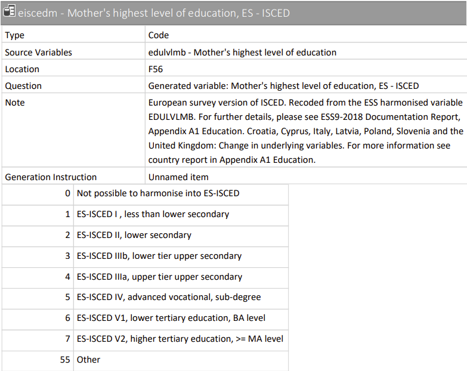

github: https://github.com/avven1re/SDA_GroupAssignment

```{r Loading Library & Data, message = F}
library(dplyr)
library(tidyverse)
library(mice)
library(ggmice)

#Input Data
ess <- readRDS("Ess round 9.RDS")
```

Create a function to find the column full of NAs
```{r Find NA Column Function}
#Find the column full of NAs
findNACol <- function(data){
  ind_vec <- c()
  j <- 1
  for (i in 1 : length(data[1, ])) {
    if(sum(is.na(data[, i])) == length(data[, i])){
      ind_vec[j] <- i
      j <- j + 1
    }
  }
  return(ind_vec)
}
```

Cutting the whole dataset by countries and get rid of NA columns
```{r}
cutd <- function(data = ess){
  cntrynames <- names(table(data$cntry))
  num_cntry <- length(cntrynames)
  cntrydata_list <- list()
  for (k in 1 : num_cntry) {
    cntry <- filter(data, cntry == cntrynames[k])
    index <- findNACol(cntry)
    processed <- cntry[, -index]
    
    cntrydata_list[[k]] <- processed
  }
  
  names(cntrydata_list) <- cntrynames
  return(cntrydata_list)
}

cntrydatalist <- cutd(ess)
```

We can see that each country has about 300~340 variables:
```{r}
summary(cntrydatalist)[, 1:2]
```

And now we get a list of each countries dataset and also remove the NA columns.

Here we can draw a barplot of the percentage every countries' missing values
```{r}
n_mvec <- matrix(NaN, nrow = 1, ncol = length(cntrydatalist))
for (i in 1 : length(cntrydatalist)) {
  n_mvec[i] <- sum(is.na(cntrydatalist[[i]])) / (dim(cntrydatalist[[i]])[1] * dim(cntrydatalist[[i]])[2]) * 100
}
colnames(n_mvec) <- names(cntrydatalist)
barplot(n_mvec, cex.names = 0.5, ylim = c(0, 0.8), main = "The missing value percentage in each country (%)")
```

Take NL for example, lets take a look of which variables include missing values:
```{r}
which(colSums(is.na(cntrydatalist$NL))>0)

m_NL_n <- names(which(colSums(is.na(cntrydatalist$NL))>0))
m_NL_n
```
From the ESS9 codebook, these variables are:
 
### eisced: Highest level of education
 
```{r, echo=FALSE, out.width = '75%'}

summary(cntrydatalist$NL["eisced"])
```

### wkhct: Total contracted hours per week in main job overtime excluded
 
```{r, echo=FALSE, out.width = '75%'}

summary(cntrydatalist$NL["wkhct"])
```

### wkhtot: Total hours normally worked per week in main job overtime included

```{r, echo=FALSE, out.width = '75%'}

summary(cntrydatalist$NL["wkhtot"])
```

### eiscedp: Partner's highest level of education
 
```{r, echo=FALSE, out.width = '75%'}

summary(cntrydatalist$NL["eiscedp"])
```

### wkhtotp: Hours normally worked a week in main job overtime included, partner
 
```{r, echo=FALSE, out.width = '75%'}

summary(cntrydatalist$NL["wkhtotp"])
```

### eiscedf: Father's highest level of education
 
```{r, echo=FALSE, out.width = '75%'}


summary(cntrydatalist$NL["eiscedf"])
```

### eiscedm: Mother's highest level of education
 
```{r, echo=FALSE, out.width = '75%'}

summary(cntrydatalist$NL["eiscedm"])
```

 - inwtm: Interview length in minutes, main questionnaire (Not Interested)
 
So we have: 4 ordinal variables include missing values and 3 numerical variables include missing values.

```{r}
# "IE" "AT" "PT" "HU" "PL"
#summary(cntrydatalist$AT$hinctnta)

AT <- cntrydatalist$AT
IE <- cntrydatalist$IE
PT <- cntrydatalist$PT
HU <- cntrydatalist$HU
PL <- cntrydatalist$PL

AT$hinctnta[AT$hinctnta == 88] <- NA
AT$hinctnta[AT$hinctnta == 77] <- NA

IE$hinctnta[IE$hinctnta == 88] <- NA
IE$hinctnta[IE$hinctnta == 77] <- NA

PT$hinctnta[PT$hinctnta == 88] <- NA
PT$hinctnta[PT$hinctnta == 77] <- NA

HU$hinctnta[HU$hinctnta == 88] <- NA
HU$hinctnta[HU$hinctnta == 77] <- NA

PL$hinctnta[PL$hinctnta == 88] <- NA
PL$hinctnta[PL$hinctnta == 77] <- NA
```

```{r}
na_mat <- matrix(c(sum(is.na(AT$hinctnta)), sum(is.na(IE$hinctnta)), 
                   sum(is.na(PT$hinctnta)), sum(is.na(HU$hinctnta)), sum(is.na(PL$hinctnta))), 1, 5)
colnames(na_mat) <- c("AT", "IE", "PT", "HU", "PL")
barplot(na_mat, main = "The number of missing values of hinctnta")

```

```{r}
per_na_mat <- matrix(c(sum(is.na(AT$hinctnta))/dim(AT)[1], sum(is.na(IE$hinctnta))/dim(IE)[1], 
                   sum(is.na(PT$hinctnta))/dim(PT)[1], sum(is.na(HU$hinctnta))/dim(HU)[1],
                   sum(is.na(PL$hinctnta))/dim(PL)[1]), 1, 5)
colnames(per_na_mat) <- c("AT", "IE", "PT", "HU", "PL")
barplot(per_na_mat, main = "The proportion of missing values of hinctnta in each country", ylim = c(0, 2.0))

```